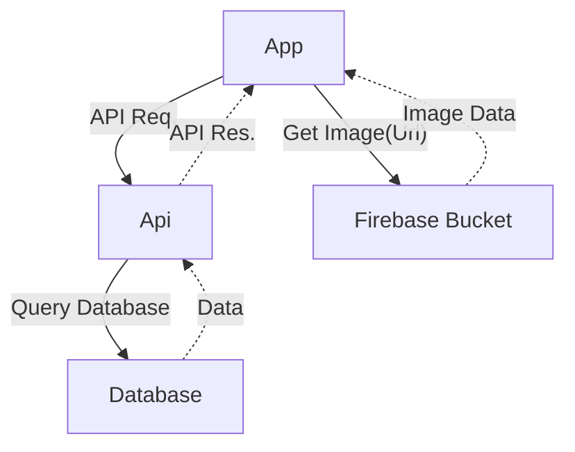

# CS466_DataDiagram

```mermaid
flowchart TD
    A["App"] -- API Req. --> B["Api"]
    A-- Get Image(Url) -->D["Firebase Bucket"]
    D-. Image Data .->A
    B -- Query Database --> C["Database"]
    C -. Data .-> B
    B -. "API Res." .->A
```
